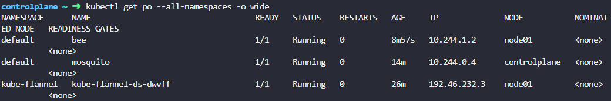
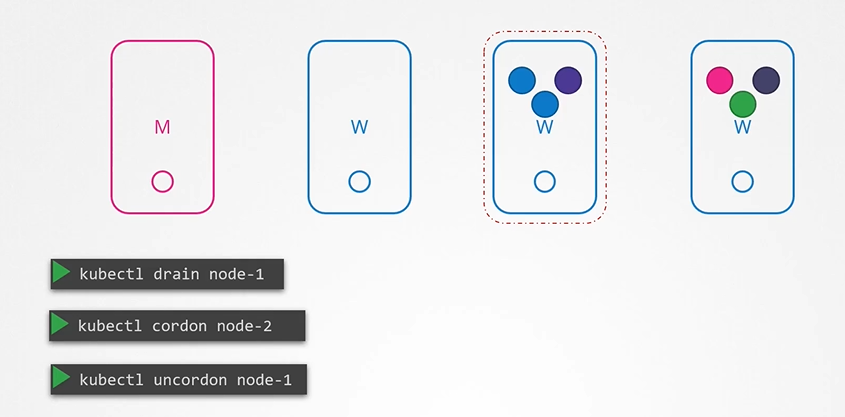

# Kubernetes Commands

1. <details> 
   <summary>Create the pod</summary>
    a) Using image name

   ```
   kubectl run nginx --image=nginx
   ```

    b) Using definition file

   ```
   kubectl create -f pod-definition.yml
   ```

   c) Getting pod yml file if it does not exist 

   ```
   kubectl run nginx --image=nginx --dry-run=client -o yml > nginx_pod.yml
   ```

   `--dry-run=client` tells `kubectl` to test without actually doing anything. `-o yaml` says "Output what you would send to API server to the console", which we then redirect into the named file.
   
   now use the YAML you created to deploy the pod.

   ```bash
   kubectl create -f nginx_pod.yaml
   ```

    Now use yml file to create the pod

    ```
    kubectl create -f nginx_pod.yml
    ```

    d)  There are three ways we can change the image name

      1. Method 1</br>
         Edit your manifest file created in last question

         ```bash
         vi redis.yaml
         ```

         Fix the image name in the redis.yaml to `redis`, save and exit.

         Apply the edited yaml

         ```bash
         kubectl apply -f redis.yaml
         ```

      2. Method 2</br>
         Edit the running pod directly (note not all fields can be edited this way)

         ```
         kubectl edit pod redis
         ```

         This will bring the pod YAML up in `vi`. Edit it as per method 1. When you eixt `vi` the change will be immediately applied. If you make a mistake, you will be dropped back into `vi`

      3. Method 3</br>
         Patch the image directly. For this you need to know the `name` of the container in the pod, as we assign the new image to that name, as in `container_image_name=new_image`

         ```bash
         kubectl set image pod/redis redis=redis
         ```
   </details>
1. <details>
    <summary>Recreate a pod using updated definition file - kubectl replace option</summary>

    ```
    $ kubectl replace --force -f <<updated pod definition file>>
    ```
    </details>
1. <details>
   <summary> Extract a pod definition</summary>

   ```
   kubectl get pod webapp -o yaml > webapp-pod.yml
   ```
   
   </details>
1. <details>
   <summary> List all the pods</summary>
   
   ```
   kubectl get po/pods
   ```
   
   </details>
1. <details>
   <summary> List all the namespaces</summary>

   ```
   kubectl get ns
   ```
   
   </details>
1. <details>
   <summary> Delete the deployed pod </summary>

   ```
   kubectl delete po <<pod name>> -n <<namespace name>>
   ```

   OR

   ```
   kubectl deploy <<pod name>> --replicas=0 -n <<namespace name>>
   ```
   </details>
1. <details>
   <summary>Why is the POD in a pending state?</br>Inspect the environment for various kubernetes control plane components.</summary>

   ```
   kubectl get pods --namespace kube-system
   ```

   There is a key pod missing here!
   </details>
1. <details>
   <summary>Create a new deployment called redis-deploy in the dev-ns namespace with the redis image. It should have 2 replicas.</summary>

   ```
   kubectl create deployment redis-deploy -n dev-ns --image redis --replicas 2
   ```
   </details>
1. <details>
   <summary> Search a pod in all namespaces </summary>

   ```
   kubectl get po --all-namespaces | grep 'blue'
   ```
   </details>
1. <details>
   <summary>Create a new namespace called dev-ns.</summary>

   ```
   kubectl create ns dev-ns
   ```
   </details>
1. <details>
   <summary>Create a pod called httpd using the image httpd:alpine in the default namespace.</br>Next, create a service of type ClusterIP by the same name (httpd).</br>The target port for the service should be 80.</summary>

   ```
   kubectl run httpd --image httpd:alpine --expose --port 80
   ```

   ```
   kubectl expose pod https --type=ClusterIP --port 80
   ```
   </details>
1. <details>
   <summary>Set default namespace in the context.</summary>

   ```
   kubectl config set-config $(kubectl config current-context) --namespace=dev
   ```
   </details>

1. <details>
   <summary> Get help </summary>

   ```
   kubectl run --help
   ```
   </details>
1. <details>
   <summary> Describe a pod</summary>
    This command is used to describe the pod and also, get the below information from the description<br>
    1. image used to create the pod <br>
    2. on which nodes pods are placed <br>
    3. get the list of containers in the pod<br>
    4. get the state of the container<br>
    5. get the container information <br>
   
   ```
   kubectl describe po <<pod name>>
   ```
   </details>
1. <details>
   <summary> Get pod information in tabular form </summary>

   ```
   kubectl get po -o wide
   ```
   </details>  
1. <details>
   <summary> Create Replication Controller </summary>

   ```
   kubectl create -f rc-definition.yaml
   ```
   </details>  
1. <details>
   <summary> Get Replication Controller </summary>

   ```
   kubectl get replicationcontroller
   ```
   </details>
1. <details>
   <summary> Create Replicaset </summary>

   ```
   kubectl create -f replicaset-definition.yaml
   ```
   </details>
1. <details>
   <summary> Get Replicaset </summary>

   ```
   kubectl get replicaset
   ```
   </details>
1. <details>
   <summary> Ways to increase the replicaset </summary>

       1. First way is to update the number of replicas in the replicaset-definition.yaml definition file

       ```
       kubectl apply -f replicaset-definition.yaml
       ```

       2. Second way is to use **`kubectl scale`** command.
       
       ```
       kubectl scale --replicas=6 -f replicaset-definition.yaml
       ```

       3. Third way is to use **`kubectl scale`** command with type and name
        
       ```
       kubectl scale --replicas=6 replicaset myapp-replicaset
       ```
    
   </details>
1. <details>
    <summary> Create deployment </summary>

    ```
    kubectl create -f deployment-definition.yaml
    ```
    </details>
1. <details>
   <summary> To get deployment </summary>

   ```
   kubectl get deployment
   ```
   </details>
1. <details>
   <summary>Generate Deployment yaml-file</summary>

   ```
   $ kubectl create deployment --image=nginx nginx --dry-run=client -o yaml > nginx.yml
   ```
   </details>
1. <details>
   <summary> Create deployment using imperative command </summary>

   ```
   kubectl create deployment  pod redis --image=redis/redis-image --replicas=3
   ```
   </details> 
1. <details>
   <summary>Create a deployment named webapp using the image kodekloud/webapp-color with 3 replicas.</summary>

   ```
   kubectl create deployment webapp --image=kodekloud/webapp-color --replicas=3
   ```
   </details>

1. <details>
   <summary> To see all object at once </summary>

   ```
   kubectl get all
   ```
   </details>
1. <details>
   <summary> Create service </summary>

   ```
   kubectl create -f service-definition.yml
   ```
   </details>
1. <details>
   <summary> To get the service </summary>

   ```
   kubectl get service
   ```
   </details>
1. <details>
   <summary> Create service </summary>

   ```
   kubectl create -f service-definition.yml
   ```
   </details>
1. <details>
   <summary> To describe the  service </summary>

   ```
   kubectl describe service
   ```
   </details>

1. <details>
   <summary> Create a Service named redis-service of type ClusterIP to expose pod redis on port 6397</summary>

   ```
   kubectl expose pod redis --port=6379 --name redis-service --dry-run=client -o yaml
   ```

   OR

   ```
   kubectl create service clusterip redis --tcp=6379:6379 --dry-run=client -o yaml
   ```
   </details>
1. <details>
   <summary> Create service using imperative command </summary>

   ```
   kubectl expose pod redis --port=6783 --name service-name
   ```
   </details>      

1. <details>
   <summary>Deploy a pod named nginx-pod using the nginx:alpine image.</summary>

   ```
   kubectl run nginx-pod --image=nginx:alpine
   ```
   </details>

1. <details>
   <summary>Deploy a redis pod using the redis:alpine image with the labels set to tier=db.</summary>

   ```
   kubectl run redis --image=redis:alpine -l tier=db
   ```
   </details>

1. <details>
   <summary>Create a service redis-service to expose the redis application within the cluster on port 6379.</summary>

   ```
   kubectl expose pod redis --port=6379 --name redis-service
   ```
   </details>
1. <details>
   <summary>Create a new pod called custom-nginx using the nginx image and expose it on container port 8080.</summary>

   ```
   kubectl run custom-nginx --image=nginx --port=8080
   ```
   </details>

1. <details>
   <summary>A pod definition file nginx.yaml is given. Create a pod using the file.</summary>

   ```
   kubectl create -f nginx.yaml
   ```
   </details>

1. <details>
   <summary>What is the status of the created POD?</summary>

   ```
   kubectl get pods
   ```

   Examine the `STATUS` column
   </details>

1. <details>
   <summary>Manually schedule the pod on node01.</summary>

   We will have to delete and recereate the pod, as the only property that may be edited on a running container is `image`

   ```
   vi nginx.yaml
   ```

   Make the following edit

   ```yaml
   ---
    apiVersion: v1
    kind: Pod
    metadata:
      name: nginx
    spec:
      nodeName: node01    # add this line
      containers:
      -  image: nginx
         name: nginx
    ```

    ```
    kubectl delete -f nginx.yaml
    kubectl create -f nginx.yaml
    ```
   </details>
1. <details>
   <summary>Now schedule the same pod on the controlplane node.</summary>

   Repeat the steps as per the previous question. Edit `nodeName` to be `controlplane`
   </details>
1. <details>
   <summary>Identify the POD which is part of the prod environment, the finance BU and of frontend tier</summary>

   We can combine label expressions with comma. Only items with _all_ the given label/value pairs will be returned, i.e. it is an `and` condition.

   ```
   kubectl get all --selector env=prod,bu=finance,tier=frontend
   ```
   </details>
1. <details>
   <summary>Use **`kubectl taint nodes`** command to taint a node.</summary>
    
   ```
   $ kubectl taint nodes <node-name> key=value:taint-effect
   ```

   Example:
   ```
   $ kubectl taint nodes node1 app=blue:NoSchedule
   ```
   </details>
1. <details>
   <summary>Remove the taint on controlplane, which currently has the taint effect of NoSchedule.</summary>

   ```
   kubectl taint nodes controlplane node-role.kubernetes.io/control-plane:NoSchedule-
   ```
   </details>
1. <details>
   <summary>Label nodes.</summary>

   ```
   kubectl label nodes <node-name> <label-key>=<label-value>
   ```

   Example
   ```
   kubectl label nodes node-1 size=Large
   ```
   </details>
1. <details>
   <summary>ECTCD Command - Get ectcd pod.</summary>
   ```
   kubectl get pods -n kube-system
   ```

   
   </details>
1. <details>
   <summary>ECTCD Command - backup.</summary>
   ```
   etcdctl backup
   ```
   </details>
1. <details>
   <summary>ECTCD Command - cluster-health.</summary>
   ```
   etcdctl cluster-health
   ```
   </details>
1. <details>
   <summary>ECTCD Command - backup.</summary>
   ```
   etcdctl backup
   ```
   </details>
1. <details>
   <summary>View the kube-apiserver options</summary>
   You can see the options with in the pod definition file located at /etc/kubernetes/manifests/kube-apiserver.yaml

   ```
   $ cat /etc/kubernetes/manifests/kube-apiserver.yaml
   ```
    
   
   </details>
1. <details>
   <summary>View kube-controller-manager options</summary>
   You can see the options within the pod located at /etc/kubernetes/manifests/kube-controller-manager.yaml

   ```
   $ cat /etc/kubernetes/manifests/kube-controller-manager.yaml
   ```
    
   
   </details>
1. <details>
   <summary>View kube-controller-manager options</summary>

   ```
   $ ps -aux | grep kube-controller-manager
   ```
    
   
   </details>
1. <details>
   <summary>View kubelet options</summary>

   ```
   $ ps -aux | grep kubelet
   ```
    
   
   </details>
1. <details>
   <summary>View kube-proxy daemonset</summary>

   ```
   $ kubectl get daemonset -n kube-system
   ```
    
   
   </details>
1. <details>
   <summary>yaml in Kubernetes</summary>
   In Kubernetes, the pod definition file has four sections
   <summary>a. apiVersion<summary>
       => This is the version of the Kubernetes api to create the object.
   <summary>b. kind<summary>
       => It refers to the type of object we are going to create.
   <summary>c. metadata<summary>
       => It is the data about the object. It is in the form of dictionary
   <summary>d. spec<summary>
       => It is a specification of the object. It is in the form of dictionary

   

   
   </details>
1. <details>
   <summary>--dry-run and -o yaml option</summary>
    <b>--dry-run:</b> By default as soon as the command is run, the resource will be created. If you simply want to test your command , use the --dry-run=client option. This will not create the resource, instead, tell you whether the resource can be created and if your command is right.

    <b>-o yaml:</b> This will output the resource definition in YAML format on screen.


   ```
   $ kubectl run nginx --image=nginx --dry-run=client -o yaml
   ```
   </details>
1. <details>
   <summary>Save deployment to yaml file</summary>

   ```
   $ kubectl create deployment nginx --image=nginx --dry-run=client -o yaml > pod-deployment.yml
   ```
   </details>
1. <details>
   <summary>Create Service</summary>
    Create service named redis-service of type ClusterIP exposed on 6379

   ```
   $ kubectl expose pod redis --port=6379 --name redis-service --dry-run=client -o yaml
   ```

   <b> OR </b>

   ```
   kubectl create service clusterip redis-service --tcp=6379:6379 --dry-run=client -o yaml
   ```
   </details>
1. <details>
   <summary>Get all object in a cluster in production (prod) environment.</summary>

   ```
   $ kubectl get all --selector env=prod 
   ```
   </details>
1. <details>
   <summary>List all the pods which are/is part of the prod environment, the finance BU and of frontend tier</summary>

   ```
   $ kubectl get all --selector  env=prod,bu=finance,tier=frontend
   ```
   </details>
1. <details>
   <summary>Taints and Tolerance</summary>
    Taints are applied on Nodes and Tolerance are pod.

   ```
   $ kubectl taint nodes <node-name> key=vale:taint-effect
   ```
   <b>taint-effect</b>

    a. <b>NoSchedule:</b> Pods that do not tolerate the taint will not be scheduled on the node.

    b. <b>PreferNoSchedule:</b> Scheduler will try to avoid placing pods that do not tolerate the taint but is not guaranteed.

    c. <b>NoExecute:</b> Existing pods on the node that do not tolerate the taint will be evicted.

    ```
    $ kubectl taint nodes node1 app=blue:NoSchedule
    ```

   </details>
1. <details>
   <summary>To see this taint.</summary>

   ```
   $ kubectl describe node kubemaster |grep Taint
   ```
   </details>
1. <details>
   <summary>To get the detail pod information (using wide).</summary>

   ```
   $ kubectl get po --all-namespaces -o wide 
   ```

   
   </details>

1.  <details>
    <summary>How many Labels exist on node node01?</summary>

    ```
    kubectl describe node node01
    ```

    Look under `Labels` section

    --- OR ---

    ```
    kubectl get node node01 --show-labels
    ```

    </details>

1.  <details>
    <summary>What is the value set to the label key beta.kubernetes.io/arch on node01?</summary>

    From the output of Q1, find the answer there.
    </details>

1.  <details>
    <summary>Apply a label color=blue to node node01</summary>

    ```
    kubectl label node node01 color=blue
    ```
    </details>

1.  <details>
    <summary>Create a new deployment named blue with the nginx image and 3 replicas.</summary>

    ```
    kubectl create deployment blue --image=nginx --replicas=3
    ```
    </details>

1.  <details>
    <summary>Which nodes can the pods for the blue deployment be placed on?</summary>


    Check if master and node01 have any taints on them that will prevent the pods to be scheduled on them. If there are no taints, the pods can be scheduled on either node.

    ```
    kubectl describe nodes controlplane | grep -i taints
    kubectl describe nodes node01 | grep -i taints
    ```
    </details>

1.  <details>
    <summary>Set Node Affinity to the deployment to place the pods on node01 only.</summary>
    Now we edit in place the deployment we created earlier. Remember that we labelled `node01` with `color=blue`? Now we are going to create an affinity to that label, which will "attract" the pods of the deployment to it.

    1.
        ```
        $ kubectl edit deployment blue
        ```
    1. Add the YAML below under the template.spec section, i.e. at the same level as `containers` as it is a POD setting. The affinity will be considered only during scheduling stage, however this edit will cause the deployment to roll out again.

      ```yaml
        affinity:
          nodeAffinity:
            requiredDuringSchedulingIgnoredDuringExecution:
              nodeSelectorTerms:
              - matchExpressions:
                - key: color
                  operator: In
                  values:
                  - blue
      ```
    </details>

1. <details>
    <summary>Which nodes are the pods placed on now?</summary>

    ```
    $ kubectl get pods -o wide
    ```
    </details>

1.  <details>
    <summary>Create a new deployment named red with the nginx image and 2 replicas, and ensure it gets placed on the controlplane node only.</summary>

    1. Create a YAML template for the deploymemt

        ```
        kubectl create deployment red --image nginx --replicas 2 --dry-run=client -o yaml > red.yaml
        ```
    1. Edit the file
        ```
        vi red.yaml
        ```
    1.  Add the toleration using the label stated in the question, and placing it as before for the `blue` deployment
      ```yaml
        affinity:
          nodeAffinity:
            requiredDuringSchedulingIgnoredDuringExecution:
              nodeSelectorTerms:
              - matchExpressions:
                - key: node-role.kubernetes.io/master
                  operator: Exists
      ```
    1. Save, exit and create the deployment
      ```
      kubectl create -f red.yaml
      ```
    1. Check the result
      ```
      $ kubectl get pods -o wide
      ```
    </details>
1. <details>
    <summary>To get a daemonsets</summary>

    ```
    $ kubectl get daemonsets
    ```
    </details>
1. <details>
    <summary>To get the detail of a daemonsets</summary>

    ```
    $ kubectl describe daemonsets <<name-daemonsets>>
    ```
    </details>
1. <details>
    <summary>To get status of the rollout</summary>

    ```
    $ kubectl rollout status deployment/myapp-deployment
    ```
    </details>
1. <details>
    <summary>To see the history and revisions</summary>

    ```
    $ kubectl rollout history deployment/myapp-deployment
    ```
    </details>
1. <details>
    <summary>To update a deployment</summary>

    ```
    $ kubectl set image deployment/myapp-deployment nginx=nginx:1.9.1
    ```
    </details>
1. <details>
    <summary>To undo a change</summary>

    ```
    $ kubectl rollout undo deployment/myapp-deployment
    ```
    </details>
1. <details>
    <summary>To get the deployment history</summary>

    ```
    $ kubectl rollout history deployment/myapp-deployment
    ```
    </details>
1. <details>
    <summary>To run a docker container</summary>

    ```
    $ docker run ubuntu
    ```
    </details>
1. <details>
    <summary>To list running containers</summary>

    ```
    $ docker ps 
    ```
    </details>
1. <details>
    <summary>To list all containers including that are stopped</summary>

    ```
    $ docker ps -a
    ```
    </details>
1. <details>
    <summary>To create config map - imperative way</summary>

    ```
    $ kubectl create configmap app-config --from-literal=APP_COLOR=blue --from-literal=APP_MODE=prod
    ```

    OR

    We can use a property file to store all properties and specify that file while creating the configmap

    ```
    $ kubectl create configmap app-config --from-file=app_config.properties
    ```
    </details>
1. <details>
    <summary>To create config map - declarative way</summary>

    config-map.yaml
    ```
    apiVersion: v1
    kind: ConfigMap
    metadata:
     name: app-config
    data:
     APP_COLOR: blue
     APP_MODE: prod
    ```
        
    Create a config map definition file and run the 'kubectl create` command to deploy it.

    ```
    $ kubectl create -f config-map.yaml
    ```
    </details>
1. <details>
    <summary>To view configMaps</summary>

    ```
    $ kubectl get configmaps (or)
    $ kubectl get cm
    ```
    </details>
1. <details>
    <summary>To describe configmaps</summary>

    ```
    $ kubectl describe configmaps
    ```
    </details>
1. <details>
    <summary>Inject configmap in pod</summary>

     ```
   apiVersion: v1
   kind: Pod
   metadata:
     name: simple-webapp-color
   spec:
    containers:
    - name: simple-webapp-color
      image: simple-webapp-color
      ports:
      - containerPort: 8080
      envFrom:
      - configMapRef:
          name: app-config
   ```
   ```
   apiVersion: v1
   kind: ConfigMap
   metadata:
     name: app-config
   data:
     APP_COLOR: blue
     APP_MODE: prod
   ```
   ```
   $ kubectl create -f pod-definition.yaml
   ```
   </details>
1. <details>
    <summary>To drain the node of all the workloads</summary>

    ```
    $ kubectl drain node-1
    ```

    ```
    $kubectl drain node01 --ignore-daemonsets
    ```

   </details>
1. <details>
    <summary>To mark node cordoned or marked as unschedulable</summary>

    ```
    $ kubectl cordon node-1
    ```
   </details>
1. <details>
    <summary>When the node is back online after a maintenance, it is still unschedulable. You then need to uncordon it.</summary>

    ```
    $ kubectl uncordon node-1
    ```

   
  
   </details>
1. <details>
   <summary>kubeadm - Upgrade master node</summary>
   a. kubeadm has an upgrade command that helps in upgrading clusters. It shows all details of the next available version for upgrade.

   ```
   $ kubeadm upgrade plan
   ```

   b. Upgrade kubeadm from v1.11 to v1.12

   ```
   $ apt-get upgrade -y kubeadm=1.12.0-00
   ```

   c. Upgrade the cluster

   ```
   $ kubeadm upgrade apply v1.12.0
   ```

   d. Run the 'kubectl get nodes' command, you will see the older version. This is because in the output of the command it is showing the versions of kubelets on each of these nodes registered with the API Server and not the version of API Server itself

   e. Upgrade 'kubelet' on the master node

   ```
   $ apt-get upgrade kubelet=1.12.0-00
   ```   

   f. Restart the kubelet

   ```
   $ systemctl restart kubelet
   ```

   g. Run 'kubectl get nodes' to verify

   ```
   $ kubectl get nodes
   ```
  
   </details>
1. <details>
   <summary>kubeadm - Upgrade worker nodes</summary>

   a. From master node, run 'kubectl drain' command to move the workloads to other nodes

   ```
   $ kubectl drain node-1
   ```

   b. Upgrade kubeadm and kubelet packages

   ```
   $ apt-get upgrade -y kubeadm=1.12.0-00
   $ apt-get upgrade -y kubelet=1.12.0-00
   ```

   c. Update the node configuration for the new kubelet version

   ```
   $ kubeadm upgrade node config --kubelet-version v1.12.0
   ```

   d. Restart the kubelet service

   ```
   $ systemctl restart kubelet
   ```

   e. Mark the node back to schedulable

   ```
   $ kubectl uncordon node-1
   ```
  
   </details>
1. <details>
    <summary>Backup - Resource Configs</summary>

    ```
    $ kubectl get all --all-namespaces -o yaml > all-deploy-services.yaml (only for few resource groups)
    ```

    There are many other resource groups that must be considered. There are tools like ARK or now called Velero by Heptio.
   </details>
1. <details>
   <summary>Backup - ETCD</summary>
   Instead of backing up resources as before, you may choose to backup the ETCD cluster itself.

   

   a. Take a snapshot of the etcd database by using etcdctl utility snapshot save command.

    ```
    $ ETCDCTL_API=3 etcdctl snapshot save snapshot.db
    ```

    ```
    $  ETCDCTL_API=3 etcdctl snapshot status snapshot.db
    ```
   </details>
1. <details>
    <summary>Restore - ETCD</summary>

   a. To restore etcd from the backup at later in time. First stop kube-apiserver service

   ```
   $ service kube-apiserver stop
   ```

   b. Run the etcdctl snapshot restore command

   c. Update the etcd service

   d. Reload system configs

   ```
   $ systemctl daemon-reload
   ```

   e. Restart etcd

   ```
   $ service etcd restart
   ```

   f. Start the kube-apiserver

   ```
   $ service kube-apiserver start
   ```

   With all etcdctl commands specify the cert,key,cacert and endpoint for authentication.

   $ ETCDCTL_API=3 etcdctl \
   snapshot save /tmp/snapshot.db \
   --endpoints=https://[127.0.0.1]:2379 \
   --cacert=/etc/kubernetes/pki/etcd/ca.crt \
   --cert=/etc/kubernetes/pki/etcd/etcd-server.crt \
   --key=/etc/kubernetes/pki/etcd/etcd-server.key

   
   </details>
1. <details>
    <summary>Get kubernetes cluster detail</summary>

    ```
    $ kubectl config get-clusters
    ```
   </details>
1. <details>
    <summary>Command to switch the container</summary>

    ```
    $ kubectl config use-context cluster1
    ```
   </details>
1. <details>
    <summary>To create service user account. </summary>

    ```
    $ kubectl create a serviceaccount sa1
    ``` 
   </details>
1. <details>
    <summary>To list service user account. </summary>

    ```
    $ kubectl list serviceaccount
    ```
   </details>
1. <details>
    <summary>Command to generate public and private security keys </summary>

   ### Private key
    ```
    $ openssl genrsa -out my-bank.key 1024
    ```


   ### Public key
   ```
   $ openssl rsa -in my-bank.key -pubout > mybankkey.pem
   ```

   </details>
1. <details>
    <summary>Certificate Authority (CA) </summary>

    ### Generate key

    ```
    $ openssl genrsa -out ca.key 2048
    ```

    ### Generate CSR

    ```
    $ openssl req -new -key ca.key -sub "/CN=KUBERNETES-CA" -out ca.csr
    ```

    ### Sign Certificates

    ```
    $ openssl x509 -req -in ca.csr -signkey ca.key -out ca.crt
    ```

   </details>
1. <details>
    <summary>Generating Client Certificates</summary>
    - Admin users certificate
    
    ### Generate Keys

    ```
    $ openssl genrsa -out admin.key 2048
    ```

    ### Generate CSR

    ```
    $ openssl req -new -key admin.key -sub "/CN=kube-admin" -out admin.csr
    ```

    ### Sign certificate

    ```
    $ openssl x509 -req in admin.csr -CA ca.crt -CAkey ca.key -out admin.crt
    ```

    ### Certificate with admin privilages

    ```
    $ openssl req -new -key admin.key -subj "/CN=kube-admin/O=system:masters" -out admin.csr
    ```

   </details>
1. <details>
    <summary>Command to convert certificate to base64 </summary>

    ```
    $ cat certificate.csr | base64
    ```

    ### Remove new lines from bacs64 output

    ```
    $ cat certificate.csr | base64 -w 0
    ```
   </details>
1. <details>
    <summary>View the kube config file </summary>

    ```
    $ kubectl config view
    ```
   </details>
1. <details>
    <summary>View the kube config file with option --kubeconfig </summary>

    ```
    $ kubectl config view --kubeconfig=config.yaml
    ```
   </details>
1. <details>
    <summary>To get the kube config help</summary>

    ```
    $ kubectl config -h
    ```
   </details>
1. <details>
    <summary>To get the api version</summary>

    ```
    $ curl https://kube-master:6443/version
    ```
    
    ### To list of all pods
    ```
    $ curl https://kube-master:6443/api/v1/pods
    ```

    ### Get all the api groups
    ```
    $ curl https://kube-master:6443 -k
    ```

    ### Get the list of name group in a api group
    ```
    $ curl https://kube-master:6443/apis -k |grep "name"
    ```
1. <details>
    <summary>Create role</summary>

    ```
    $ kubectl create -f devuser-developer-binding.yaml
    ```

   ```
   apiVersion: rbac.authorization.k8s.io/v1
   kind: Role
   metadata:
      name: developer
   rules:
   - apiGroups: [""] # "" indicates the core API group
      resources: ["pods"]
      verbs: ["get", "list", "update", "delete", "create"]
   - apiGroups: [""]
      resources: ["ConfigMap"]
      verbs: ["create"]
   ```
   ```
   apiVersion: rbac.authorization.k8s.io/v1
   kind: RoleBinding
   metadata:
      name: devuser-developer-binding
   subjects:
   - kind: User
      name: dev-user # "name" is case sensitive
      apiGroup: rbac.authorization.k8s.io
   roleRef:
      kind: Role
      name: developer
      apiGroup: rbac.authorization.k8s.io
   ```
   </details>
1. <details>
    <summary>To list the role</summary>

    ```
    $ kubectl get roles
    ```
   </details>
1. <details>
    <summary>To list the role bindings</summary>

    ```
    $ kubectl get rolebindings
    ```
   </details>
1. <details>
    <summary>To describe the role</summary>

    ```
    $ kubectl describe role developer
    ```
   </details>
1. <details>
    <summary>To describe the role binding</summary>

    ```
    $ kubectl describe rolebinding devuser-developer-binding
    ```
   </details>   
1. <details>
    <summary>A user would like to see if you have access to a particular resource in the cluster.</summary>

    You can use the kubectl auth command
      ```
      $ kubectl auth can-i create deployments
      $ kubectl auth can-i delete nodes
      ```
      ```
      $ kubectl auth can-i create deployments --as dev-user
      $ kubectl auth can-i create pods --as dev-user
      ```
      ```
      $ kubectl auth can-i create pods --as dev-user --namespace test
      ```
   </details>   
1. <details>
    <summary>To get all resources in namespaces</summary>

    ```
    $ kubectl api-resources --namespaced=true
    ```
   </details>   
1. <details>
    <summary>To get all resources in cluster</summary>

    ```
    $ kubectl api-resources --namespaced=false
    ```
   </details>   
1. <details>
    <summary>To get all resources in namespaces</summary>

    ```
    $ kubectl api-resources --namespaced=true
    ```
   </details>   
1. <details>
    <summary>To get the list of service account</summary>

    ```
    $ kubectl get serviceaccounts
    ```
   </details> 
1. <details>
    <summary>To get the secret token used in the service accounts</summary>

    ```
    $ kubectl describe serviceaccount default
    ```
   </details> 
1. <details>
    <summary>To create a service accounts</summary>

    ```
    $ kubectl create serviceaccount dashboard-sa
    ```
   </details> 
1. <details>
    <summary>To get the token detail of a service account</summary>

    ```
    $ kubectl create serviceaccount dashboard-sa-token-kbbdm    ```
   </details> 
1. <details>
    <summary>To get the network policies</summary>

    ```
    $ kubectl get networkpolicies
    ```
   </details> 
1. <details>
    <summary>To describe the network policies</summary>

    ```
    $ kubectl describe networkpolicies payroll-policies
    ```
   </details> 
1. <details>
    <summary>To get network policy information using svc</summary>

    ```
    $ kubectl get svc -n kube-system
    ```
   </details> 


   
