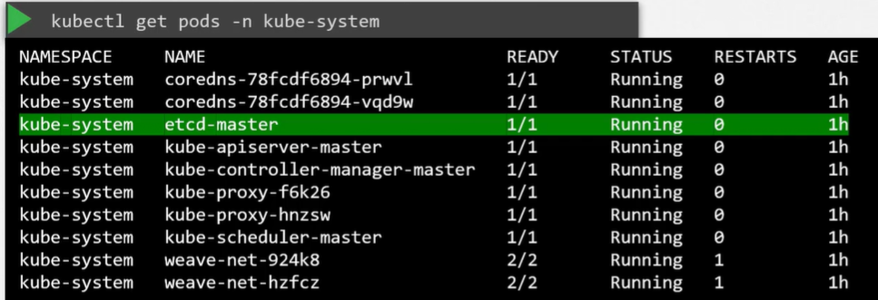
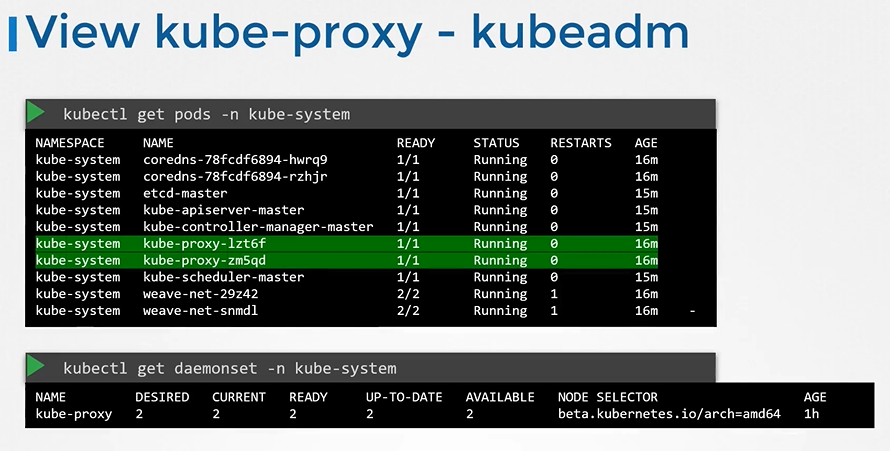
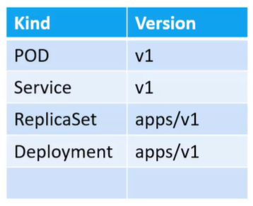
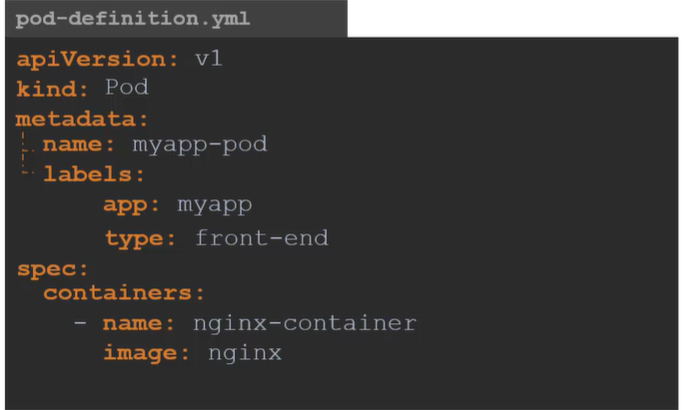

# Kubernetes Commands

1. <details> 
   <summary>Create the pod</summary>
    a) Using image name

   ```
   kubectl run nginx --image=nginx
   ```

    b) Using definition file

   ```
   kubectl create -f pod-definition.yml
   ```

   c) Getting pod yml file if it does not exist 

   ```
   kubectl run nginx --image=nginx --dry-run=client -o yml > nginx_pod.yml
   ```

   `--dry-run=client` tells `kubectl` to test without actually doing anything. `-o yaml` says "Output what you would send to API server to the console", which we then redirect into the named file.
   
   now use the YAML you created to deploy the pod.

   ```bash
   kubectl create -f nginx_pod.yaml
   ```

    Now use yml file to create the pod

    ```
    kubectl create -f nginx_pod.yml
    ```

    d)  There are three ways we can change the image name

      1. Method 1</br>
         Edit your manifest file created in last question

         ```bash
         vi redis.yaml
         ```

         Fix the image name in the redis.yaml to `redis`, save and exit.

         Apply the edited yaml

         ```bash
         kubectl apply -f redis.yaml
         ```

      2. Method 2</br>
         Edit the running pod directly (note not all fields can be edited this way)

         ```
         kubectl edit pod redis
         ```

         This will bring the pod YAML up in `vi`. Edit it as per method 1. When you eixt `vi` the change will be immediately applied. If you make a mistake, you will be dropped back into `vi`

      3. Method 3</br>
         Patch the image directly. For this you need to know the `name` of the container in the pod, as we assign the new image to that name, as in `container_image_name=new_image`

         ```bash
         kubectl set image pod/redis redis=redis
         ```
   </details>
1. <details>
   <summary> Extract a pod definition</summary>

   ```
   kubectl get pod webapp -o yaml > webapp-pod.yml
   ```
   
   </details>
1. <details>
   <summary> List all the pods</summary>
   
   ```
   kubectl get po/pods
   ```
   
   </details>
1. <details>
   <summary> List all the namespaces</summary>

   ```
   kubectl get ns
   ```
   
   </details>
1. <details>
   <summary> Delete the deployed pod </summary>

   ```
   kubectl delete po <<pod name>> -n <<namespace name>>
   ```

   OR

   ```
   kubectl deploy <<pod name>> --replicas=0 -n <<namespace name>>
   ```
   </details>
1. <details>
   <summary>Why is the POD in a pending state?</br>Inspect the environment for various kubernetes control plane components.</summary>

   ```
   kubectl get pods --namespace kube-system
   ```

   There is a key pod missing here!
   </details>
1. <details>
   <summary>Create a new deployment called redis-deploy in the dev-ns namespace with the redis image. It should have 2 replicas.</summary>

   ```
   kubectl create deployment redis-deploy -n dev-ns --image redis --replicas 2
   ```
   </details>
1. <details>
   <summary> Search a pod in all namespaces </summary>

   ```
   kubectl get po --all-namespaces | grep 'blue'
   ```
   </details>
1. <details>
   <summary>Create a new namespace called dev-ns.</summary>

   ```
   kubectl create ns dev-ns
   ```
   </details>
1. <details>
   <summary>Create a pod called httpd using the image httpd:alpine in the default namespace.</br>Next, create a service of type ClusterIP by the same name (httpd).</br>The target port for the service should be 80.</summary>

   ```
   kubectl run httpd --image httpd:alpine --expose --port 80
   ```

   ```
   kubectl expose pod https --type=ClusterIP --port 80
   ```
   </details>
1. <details>
   <summary>Set default namespace in the context.</summary>

   ```
   kubectl config set-config $(kubectl config current-context) --namespace=dev
   ```
   </details>

1. <details>
   <summary> Get help </summary>

   ```
   kubectl run --help
   ```
   </details>
1. <details>
   <summary> Describe a pod</summary>
    This command is used to describe the pod and also, get the below information from the description<br>
    1. image used to create the pod <br>
    2. on which nodes pods are placed <br>
    3. get the list of containers in the pod<br>
    4. get the state of the container<br>
    5. get the container information <br>
   
   ```
   kubectl describe po <<pod name>>
   ```
   </details>
1. <details>
   <summary> Get pod information in tabular form </summary>

   ```
   kubectl get po -o wide
   ```
   </details>  
1. <details>
   <summary> Create Replication Controller </summary>

   ```
   kubectl create -f rc-definition.yaml
   ```
   </details>  
1. <details>
   <summary> Get Replication Controller </summary>

   ```
   kubectl get replicationcontroller
   ```
   </details>
1. <details>
   <summary> Create Replicaset </summary>

   ```
   kubectl create -f replicaset-definition.yaml
   ```
   </details>
1. <details>
   <summary> Get Replicaset </summary>

   ```
   kubectl get replicaset
   ```
   </details>
1. <details>
   <summary> Ways to increase the replicaset </summary>

       1. First way is to update the number of replicas in the replicaset-definition.yaml definition file

       ```
       kubectl apply -f replicaset-definition.yaml
       ```

       2. Second way is to use **`kubectl scale`** command.
       
       ```
       kubectl scale --replicas=6 -f replicaset-definition.yaml
       ```

       3. Third way is to use **`kubectl scale`** command with type and name
        
       ```
       kubectl scale --replicas=6 replicaset myapp-replicaset
       ```
    
   </details>
1. <details>
    <summary> Create deployment </summary>

    ```
    kubectl create -f deployment-definition.yaml
    ```
    </details>
1. <details>
   <summary> To get deployment </summary>

   ```
   kubectl get deployment
   ```
   </details>
1. <details>
   <summary>Generate Deployment yaml-file</summary>

   ```
   $ kubectl create deployment --image=nginx nginx --dry-run=client -o yaml > nginx.yml
   ```
   </details>
1. <details>
   <summary> Create deployment using imperative command </summary>

   ```
   kubectl deployment  pod redis --image=redis/redis-image --replicas=3
   ```
   </details> 
1. <details>
   <summary>Create a deployment named webapp using the image kodekloud/webapp-color with 3 replicas.</summary>

   ```
   kubectl create deployment webapp --image=kodekloud/webapp-color --replicas=3
   ```
   </details>

1. <details>
   <summary> To see all object at once </summary>

   ```
   kubectl get all
   ```
   </details>
1. <details>
   <summary> Create service </summary>

   ```
   kubectl create -f service-definition.yml
   ```
   </details>
1. <details>
   <summary> To get the service </summary>

   ```
   kubectl get service
   ```
   </details>
1. <details>
   <summary> Create service </summary>

   ```
   kubectl create -f service-definition.yml
   ```
   </details>
1. <details>
   <summary> To describe the  service </summary>

   ```
   kubectl describe service
   ```
   </details>

1. <details>
   <summary> Create a Service named redis-service of type ClusterIP to expose pod redis on port 6397</summary>

   ```
   kubectl expose pod redis --port=6379 --name redis-service --dry-run=client -o yaml
   ```

   OR

   ```
   kubectl create service clusterip redis --tcp=6379:6379 --dry-run=client -o yaml
   ```
   </details>
1. <details>
   <summary> Create service using imperative command </summary>

   ```
   kubectl expose pod redis --port=6783 --name service-name
   ```
   </details>      

1. <details>
   <summary>Deploy a pod named nginx-pod using the nginx:alpine image.</summary>

   ```
   kubectl run nginx-pod --image=nginx:alpine
   ```
   </details>

1. <details>
   <summary>Deploy a redis pod using the redis:alpine image with the labels set to tier=db.</summary>

   ```
   kubectl run redis --image=redis:alpine -l tier=db
   ```
   </details>

1. <details>
   <summary>Create a service redis-service to expose the redis application within the cluster on port 6379.</summary>

   ```
   kubectl expose pod redis --port=6379 --name redis-service
   ```
   </details>
1. <details>
   <summary>Create a new pod called custom-nginx using the nginx image and expose it on container port 8080.</summary>

   ```
   kubectl run custom-nginx --image=nginx --port=8080
   ```
   </details>

1. <details>
   <summary>A pod definition file nginx.yaml is given. Create a pod using the file.</summary>

   ```
   kubectl create -f nginx.yaml
   ```
   </details>

1. <details>
   <summary>What is the status of the created POD?</summary>

   ```
   kubectl get pods
   ```

   Examine the `STATUS` column
   </details>

1. <details>
   <summary>Manually schedule the pod on node01.</summary>

   We will have to delete and recereate the pod, as the only property that may be edited on a running container is `image`

   ```
   vi nginx.yaml
   ```

   Make the following edit

   ```yaml
   ---
    apiVersion: v1
    kind: Pod
    metadata:
      name: nginx
    spec:
      nodeName: node01    # add this line
      containers:
      -  image: nginx
         name: nginx
    ```

    ```
    kubectl delete -f nginx.yaml
    kubectl create -f nginx.yaml
    ```
   </details>
1. <details>
   <summary>Now schedule the same pod on the controlplane node.</summary>

   Repeat the steps as per the previous question. Edit `nodeName` to be `controlplane`
   </details>
1. <details>
   <summary>Identify the POD which is part of the prod environment, the finance BU and of frontend tier</summary>

   We can combine label expressions with comma. Only items with _all_ the given label/value pairs will be returned, i.e. it is an `and` condition.

   ```
   kubectl get all --selector env=prod,bu=finance,tier=frontend
   ```
   </details>
1. <details>
   <summary>Use **`kubectl taint nodes`** command to taint a node.</summary>
    
   ```
   $ kubectl taint nodes <node-name> key=value:taint-effect
   ```

   Example:
   ```
   $ kubectl taint nodes node1 app=blue:NoSchedule
   ```
   </details>
1. <details>
   <summary>Remove the taint on controlplane, which currently has the taint effect of NoSchedule.</summary>

   ```
   kubectl taint nodes controlplane node-role.kubernetes.io/control-plane:NoSchedule-
   ```
   </details>
1. <details>
   <summary>Label nodes.</summary>

   ```
   kubectl label nodes <node-name> <label-key>=<label-value>
   ```

   Example
   ```
   kubectl label nodes node-1 size=Large
   ```
   </details>
1. <details>
   <summary>ECTCD Command - Get ectcd pod.</summary>
   ```
   kubectl get pods -n kube-system
   ```

   
   </details>
1. <details>
   <summary>ECTCD Command - backup.</summary>
   ```
   etcdctl backup
   ```
   </details>
1. <details>
   <summary>ECTCD Command - cluster-health.</summary>
   ```
   etcdctl cluster-health
   ```
   </details>
1. <details>
   <summary>ECTCD Command - backup.</summary>
   ```
   etcdctl backup
   ```
   </details>
1. <details>
   <summary>View the kube-apiserver options</summary>
   You can see the options with in the pod definition file located at /etc/kubernetes/manifests/kube-apiserver.yaml

   ```
   $ cat /etc/kubernetes/manifests/kube-apiserver.yaml
   ```
    
   
   </details>
1. <details>
   <summary>View kube-controller-manager options</summary>
   You can see the options within the pod located at /etc/kubernetes/manifests/kube-controller-manager.yaml

   ```
   $ cat /etc/kubernetes/manifests/kube-controller-manager.yaml
   ```
    
   
   </details>
1. <details>
   <summary>View kube-controller-manager options</summary>

   ```
   $ ps -aux | grep kube-controller-manager
   ```
    
   
   </details>
1. <details>
   <summary>View kubelet options</summary>

   ```
   $ ps -aux | grep kubelet
   ```
    
   
   </details>
1. <details>
   <summary>View kube-proxy daemonset</summary>

   ```
   $ kubectl get daemonset -n kube-system
   ```
    
   
   </details>
1. <details>
   <summary>yaml in Kubernetes</summary>
   In Kubernetes, the pod definition file has four sections
   <summary>a. apiVersion<summary>
       => This is the version of the Kubernetes api to create the object.
   <summary>b. kind<summary>
       => It refers to the type of object we are going to create.
   <summary>c. metadata<summary>
       => It is the data about the object. It is in the form of dictionary
   <summary>d. spec<summary>
       => It is a specification of the object. It is in the form of dictionary

   

   
   </details>
1. <details>
   <summary>--dry-run and -o yaml option</summary>
    <b>--dry-run:</b> By default as soon as the command is run, the resource will be created. If you simply want to test your command , use the --dry-run=client option. This will not create the resource, instead, tell you whether the resource can be created and if your command is right.

    <b>-o yaml:</b> This will output the resource definition in YAML format on screen.


   ```
   $ kubectl run nginx --image=nginx --dry-run=client -o yaml
   ```
   </details>
1. <details>
   <summary>Save deployment to yaml file</summary>

   ```
   $ kubectl create deployment nginx --image=nginx --dry-run=client -o yaml > pod-deployment.yml
   ```
   </details>
1. <details>
   <summary>Create Service</summary>
    Create service named redis-service of type ClusterIP exposed on 6379
    
   ```
   $ kubectl expose pod redis --port=6379 --name redis-service --dry-run=client -o yaml
   ```

   <b> OR </b>

   ```
   kubectl create service clusterip redis-service --tcp=6379:6379 --dry-run=client -o yaml
   ```
   </details>
