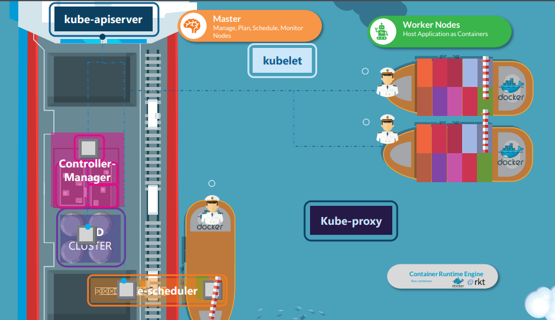

# Cluster Architecture

In this section , we will take a look at the kubernetes Architecture at high level.

  
  
  

K8s Reference Docs:
- https://kubernetes.io/docs/concepts/architecture/

## Master Node ##
In Kubernetes, a master node is a critical component of the cluster responsible for managing the entire orchestration and coordination of the containerized applications running on the worker nodes.

The master node:
- the control plane that makes decisions of the overall state of the cluster
- responsible to various events
- desired state of the system matches the actual state.
- the master node consists of several key components:
  - API server
  - Controller manager
  - Scheduler
  - etcd

### Number of master node in a cluster ###
A minimum of ***three*** master nodes required for high availability and fault tolerance. Having multiple master nodes helps in to ensure that the control plane remains operational even if one or more nodes fail. 
**This configuration is often refered to as a highly available (HA) or multi-master setup**

## Kubernetes Cluster

- A Kubernetes cluster consists if a set of worker machines, called ***Node*** that run conternarized applications.
- The worker node/s host the Pods that are the components of the application workload.
- The control plane manages the ***worker nodes and the Pods*** in the cluster.
  
  

- In ***Production Environment***, the control plane usually runs across multiple computers and a cluster runs multiple nodes, providing **fault-tolerance** and high availability.
  
# The components of a Kubernetes cluster

- ## Control Plane Components
  - Make global decisions about the cluster like scheduling
  - Detecting and responding to cluster events like starting up a new pod when deployment's replicas field is unsatisfied.
  - It can run on any machine in the cluster.

- ## kube-api
  - It exposes the kubernetes API.
  - API server is the front end for the Kubernetes control plane.
  - kube-api server is scale horizontally - it scales by deploying more instances.
  - Run multiple instances of kube-api server to balance the traffic between those instances.

- ## etcd
  - backing store of all cluster data
  - store information in key-value pair.
  - it's consistent and highly available

- ## kube-scheduler
  - It watches for newly created Pods and no assigned node and select a node for them to run.
  - Factors for scheduling decisions
    - individual and collective resource requirements
    - hardware/software/policy constraints
    - affinity and ani-affinity specification
    - data locality 
    - inter-workload interference
    - deadlines

- ## kube-controller-manager
  - this component runs controller processes
  - Logically, each controller is a separate process, but to reduce complexity, they are all compiled into a single binary and run in a single process.
  - Different type of controller
    - **Node controller:** Responsible for noticing and responding when nodes go down.
    - **Job controller:** Watches for job objects that represent one-off tasks, then creates Pods to run those task to complete.
    - **EndpointSlice controller:** Populates EndpointSlice objects (to provide a link between Service and Pods).
    - **ServiceAccount controller:** Create default ServiceAccounts for new namespaces.

- ## cloud-controller-manager
  - It only runs controllers that are specific to your cloud provider.
  - It combines several logically independent control loops into a single binary that you run as a single process.
  - It can be scale horizontally to improve performance or to help tolerate failures.
  - **Cloud provider dependencies**:
    - **Node controller:** It determine if a node has been deleted in the cloud after it stops responding.
    - **Route controller:** setting up routes in the underlying cloud infrastructure.
    - **Service controller:** creating, updating and deleting cloud provider load balancers.

# Node Components
It run on every node, maintaining running pods and providing Kubernetes runtime environment

- ## kubelet
  - An agent that runs on each node in the cluster
  - It's responsibility to make sure that the containers are running in the pod
  - It will not manage the containers which were not created by Kubernetes.

- ## kube-proxy
  - It is a network proxy that runs on each node in a cluster
  - It maintains network rules on nodes
  - Also, network communication to your Pods from network sessions inside or outside of a cluster.
  - It uses the operating system packet filtering layer
    - if there is one and it's available
    - otherwise, it forwards the traffic itself

- ## Container runtime
  - Components ensures to run container effectively
  - It is responsible for managing the execution and lifecycle of containers within the Kubernetes environment.

- ## Addons
  - It uses Kubernetes resources like DaemonSet, Deployment, etc to implement cluster features.
  - It provides cluster-level features, namespaced resources for addons belong within the kube-system namespace.

- ## DNS
  - All Kubernetes cluster should have cluster DNS
  - Cluster DNS is a DNS server, in addition to other DNS server in the environment
  - Containers started by Kubernetes automatically include DNS server in their DNS searches

- ## Web UI (Dashboard)
  - It is a general purpose web based UI for Kubernetes cluster
  - Allows users to manage and troubleshoot application running in the cluster.

- ## Cluster-level Logging
  - This mechanism is responsible for saving container logs to a central log store with search/browsing interface.

     

