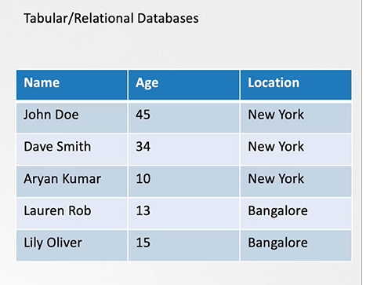

# ETCD for Beginners

## What is a ETCD?
     - ETCD is a distributed reliable key-value store that is simple, secure & Fast.

## What is a Key-Value Store
   - Traditionally, databases have been in tabular format, you must have heared about SQL or Relational databases. They store data in rows and columns

     

   - A Key-Value Store stores information in a Key and Value format.

     

## Install ETCD
   - Its easy to install and get started with **`ETCD`**.
     - Download the relevant binary for your operating system from github releases page (https://github.com/etcd-io/etcd/releases)

       For Example: To download ETCD v3.5.6, run the below curl command

       ```
       $ curl -LO https://github.com/etcd-io/etcd/releases/download/v3.5.6/etcd-v3.5.6-linux-amd64.tar.gz
       ```
     - Extract it.
       ```
       $ tar xvzf etcd-v3.5.6-linux-amd64.tar.gz
       ```
     - Run the ETCD Service
       ```
       $ ./etcd
       ```
     - When you start **`ETCD`** it will by default listens on port **`2379`**
      - The default client that comes with **`ETCD`** is the [**`etcdctl`**](https://github.com/etcd-io/etcd/tree/main/etcdctl) client. You can use it to store and retrieve key-value pairs.
        ```
        Syntax: To Store a Key-Value pair
        $ ./etcdctl put key1 value1
        ```
        ```
        Syntax: To retrieve the stored data
        $ ./etcdctl get key1
        ```
        ```
        Syntax: To view more commands. Run etcdctl without any arguments
        $ ./etcdctl
        ```

        

      ## etcd version
      ```
      ./etcdctl --version
      generally results:
      etcdctl version: 3.3.11
      API version: 2
      ```

      To match the hadoop and API version will export ETCDCTL_API=3 

      Command:
      export ETCDCTL_API=3

      ./etcdctl version

  ## Role of ECTDCD
      The 'ectdcd' datastore stores the information regarding the cluster such as Nodes, PODs, Configs, Secrets, Accounts, Roles, Bindings, Others

      ```
      
      kubectl exec etcd-master -n kube-system -- sh -c "ETCDCTL_API=3 etcdctl get / --prefix --keys-only --limit=10 --cacert /etc/kubernetes/pki/etcd/ca.crt --cert /etc/kubernetes/pki/etcd/server.crt  --key /etc/kubernetes/pki/etcd/server.key" 
      ```


       K8s Reference Docs:
       - https://kubernetes.io/docs/concepts/overview/components/
       - https://etcd.io/docs/
       - https://kubernetes.io/docs/tasks/administer-cluster/configure-upgrade-etcd/

