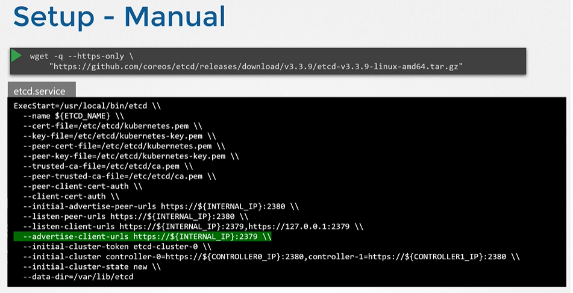

# ETCD in Kubernetes

## ETCD Datastore
- The ETCD Datastore stores information regarding the cluster such as **`Nodes`**, **`PODS`**, **`Configs`**, **`Secrets`**, **`Accounts`**, **`Roles`**, **`Bindings`** and **`Others`**.
- Every information you see when you run the **`kubectl get`** command is from the **`ETCD Server`**.

## Setup - Manual
- To setup cluster from scratch we need to deploy **`ETCD`** by downloading ETCD Binaries
- Installing Binaries and Configuring ETCD as a service in your master node yourself.
- 
  ```
  $ wget -q --https-only "https://github.com/etcd-io/etcd/releases/download/v3.3.11/etcd-v3.3.11-linux-amd64.tar.gz"
  ```

  
  
## Setup - Kubeadm
- If you setup your cluster using **`kubeadm`** then kubeadm will deploy etcd server for you as a pod in **`kube-system`** namespace.
  ```
  $ kubectl get pods -n kube-system
  ```
  

## Explore ETCD
- To list all keys stored by kubernetes, run the below command
  ```
  $ kubectl exec etcd-master -n kube-system -- sh -c "ETCDCTL_API=3 etcdctl --cert=/etc/kubernetes/pki/etcd/server.crt --key=/etc/kubernetes/pki/etcd/server.key --cacert=/etc/kubernetes/pki/etcd/ca.crt get / --prefix --keys-only"
  ```
- Kubernetes Stores data in a specific directory structure, the root directory is the **`registry`** and under that you have varies kubernetes constructs such as **`minions`**, **`nodes`**, **`pods`**, **`replicasets`**, **`deployments`**, **`roles`**, **`secrets`** and **`Others`**.
  
  

## ETCD in HA Environment
   - In a high availability environment, you will have multiple master nodes in your cluster that will have multiple ETCD Instances spread across the master nodes.
   - Make sure etcd instances know each other by setting the right parameter in the **`etcd.service`** configuration. The **`--initial-cluster`** option where you need to specify the different instances of the etcd service.
     

K8s Reference Docs:
- https://kubernetes.io/docs/tasks/administer-cluster/configure-upgrade-etcd/
- https://kubernetes.io/docs/setup/production-environment/tools/kubeadm/setup-ha-etcd-with-kubeadm/
- https://kubernetes.io/docs/setup/production-environment/tools/kubeadm/high-availability/#stacked-control-plane-and-etcd-nodes
- https://kubernetes.io/docs/setup/production-environment/tools/kubeadm/high-availability/#external-etcd-nodes
