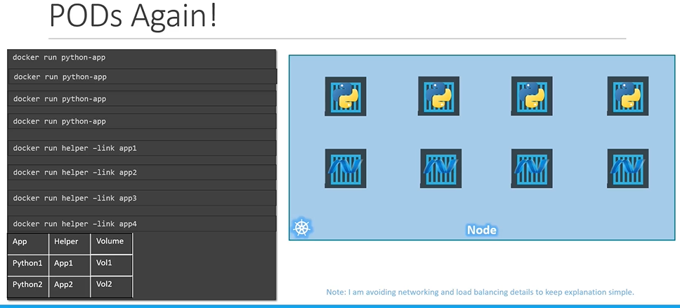
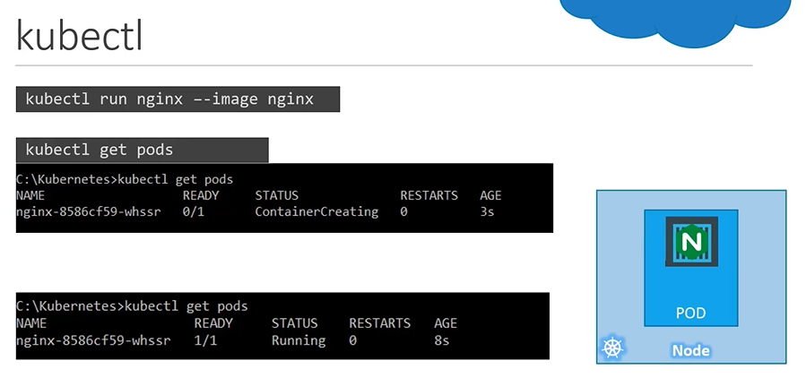
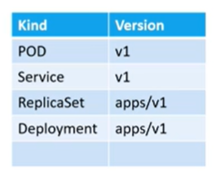

# Pods

#### Kubernetes doesn't deploy containers directly on the worker node.

  
  
#### Here is a single node kubernetes cluster with single instance of your application running in a single docker container encapsulated in the pod.


#### Pod will have a one-to-one relationship with containers running your application.

  
  
## Multi-Container PODs
- A single pod can have multiple containers except for the fact that they are usually not multiple containers of the **`same kind`**.
  
  
  
## Docker Example (Docker Link)
  
  
  
## How to deploy pods?
Lets now take a look to create a nginx pod using **`kubectl`**.

- To deploy a docker container by creating a POD.
  ```
  $ kubectl run nginx --image nginx
  ```

- To get the list of pods
  ```
  $ kubectl get pods
  ```

 

# Creating a POD using yaml file
Kubernetes configuration file contain four top level fields
- apiVersion
  - version of the kubernetes api version
  - different kind of versions
  
    

- kind
  - kind of object 
  
- metadata
  - it is having 'name' and 'labels' (which is a dictionary)

    

-spec
  - it is a dictionary. It has a property like 'container' which will be a list/array


K8s Reference Docs:
- https://kubernetes.io/docs/concepts/workloads/pods/pod/
- https://kubernetes.io/docs/concepts/workloads/pods/pod-overview/
- https://kubernetes.io/docs/tutorials/kubernetes-basics/explore/explore-intro/


