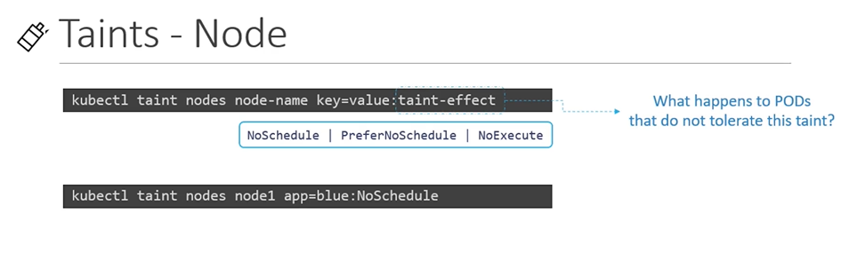

# Taints and Tolerations

In Kubernetes, "taints" and "tolerations" are mechanisms used to influence the scheduling of pods onto nodes in a cluster. These features help administrators control which nodes can run particular pods based on certain conditions.

#### Taints and Tolerations are used to set restrictions on what pods can be scheduled on a node. 
- Only pods which are tolerant to the particular taint on a node will get scheduled on that node.

  
  
## Taints
- Use **`kubectl taint nodes`** command to taint a node.

  Syntax
  ```
  $ kubectl taint nodes <node-name> key=value:taint-effect
  ```
 
  Example
  ```
  $ kubectl taint nodes node1 app=blue:NoSchedule
  ```
  
- The taint effect defines what would happen to the pods if they do not tolerate the taint.
- There are 3 taint effects
  - **`NoSchedule`**
  - **`PreferNoSchedule`**
  - **`NoExecute`**

A "taint" is a property of a node that repels a set of pods. Taints are applied to nodes and prevent the scheduling of pods that do not tolerate the taint. Nodes can have zero or more taints, and each taint has a key, value, and effect.

- Key: A string that identifies the taint.
- Value: An optional string associated with the key.
- Effect: Specifies the effect of the taint, and it can be one of the following:
  - NoSchedule: Pods that do not tolerate the taint will not be scheduled on the node.
  - PreferNoSchedule: Scheduler will try to avoid placing pods that do not tolerate the taint but is not guaranteed.
  - NoExecute: Existing pods on the node that do not tolerate the taint will be evicted.
  
  
  
## Tolerations
   - Tolerations are added to pods by adding a **`tolerations`** section in pod definition.
     ```
     apiVersion: v1
     kind: Pod
     metadata:
      name: myapp-pod
     spec:
      containers:
      - name: nginx-container
        image: nginx
      tolerations:
      - key: "app"
        operator: "Equal"
        value: "blue"
        effect: "NoSchedule"
     ```
    
  A "toleration" is a pod's declaration that it can tolerate a particular taint. When a pod specifies a toleration for a certain taint, it can be scheduled onto nodes with that taint. Tolerations have the following components:

  - Key: The key of the taint to tolerate.
  - Operator: Can be one of Exists (tolerate all values for the given key) or Equal (tolerate only the specified value for the given key).
  - Value: The value of the taint to tolerate (optional).
  
  
    

#### Taints and Tolerations do not tell the pod to go to a particular node. Instead, they tell the node to only accept pods with certain tolerations.
- To see this taint, run the below command
  ```
  $ kubectl describe node kubemaster |grep Taint
  ```
 
 
  
     
#### K8s Reference Docs
- https://kubernetes.io/docs/concepts/scheduling-eviction/taint-and-toleration/

