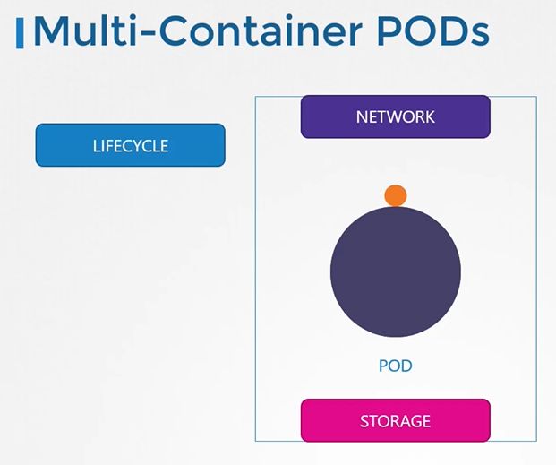

# Multi-Container Pods

## Monolith and Microservices

  
  
#### Multi-Container Pods

  
  
- To create a new multi-container pod, add the new container information to the pod definition file.
  ```
  apiVersion: v1
  kind: Pod
  metadata:
    name: simple-webapp
    labels:
      name: simple-webapp
  spec:
    containers:
    - name: simple-webapp
      image: simple-webapp
      ports:
      - ContainerPort: 8080
    - name: log-agent
      image: log-agent
  ```
  
 
#### K8s Reference Docs
- https://kubernetes.io/docs/tasks/access-application-cluster/communicate-containers-same-pod-shared-volume/
