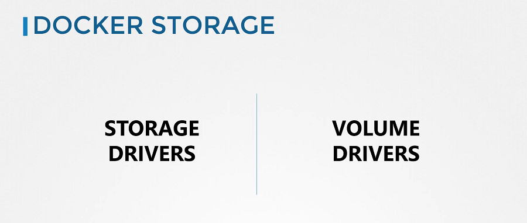

# Introduction to Docker Storage

- To understand storage in the container orchestration tools like **Kubernetes**, It is important to first understand how storage works with containers. Understanding how storage works with **Docker** first and getting all the basics right will later make it so much easier to understand how it works in **Kubernetes**.

## Docker Storage

- There are two concepts comes into the docker, Storage drivers and Volume drivers plugins. 

#### We will first discuss about Storage drivers.

#### Docker Reference Docs

- https://docs.docker.com/storage/storagedriver/
- https://docs.docker.com/storage/volumes/